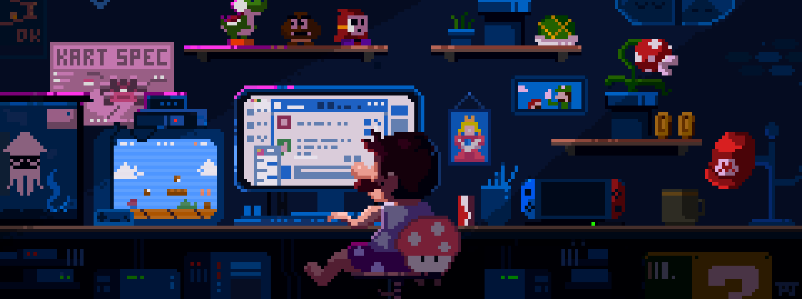

# ✨ About Me
- 👋 Hi, I’m @Fiiel
- 👀 I’m interested in **.NET, C#, WPF, ASP.NET & JavaScript**...
- 🌱 I'm currently learning and enhancing my skills in the stated language & framework above!
- 🔖 Build, build, and create!

## 📬 Contacts

 

## 🛠️ Languages, Tools, & Libraries
<!---
     
  
--->

 
   
   
      
    
   
   
    
   

 

<!---
Fiiel/Fiiel is a ✨ special ✨ repository because its `README.md` (this file) appears on your GitHub profile.
You can click the Preview link to take a look at your changes.
--->
